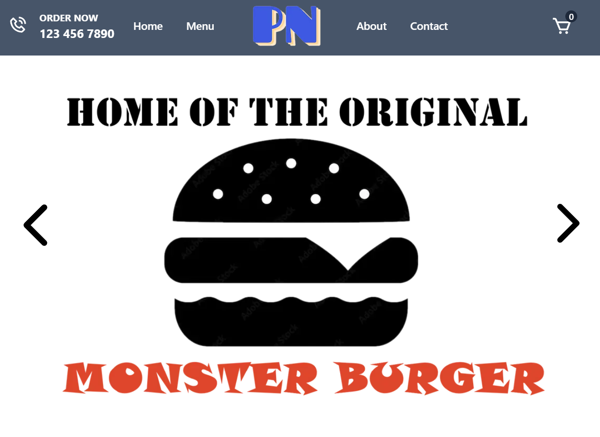
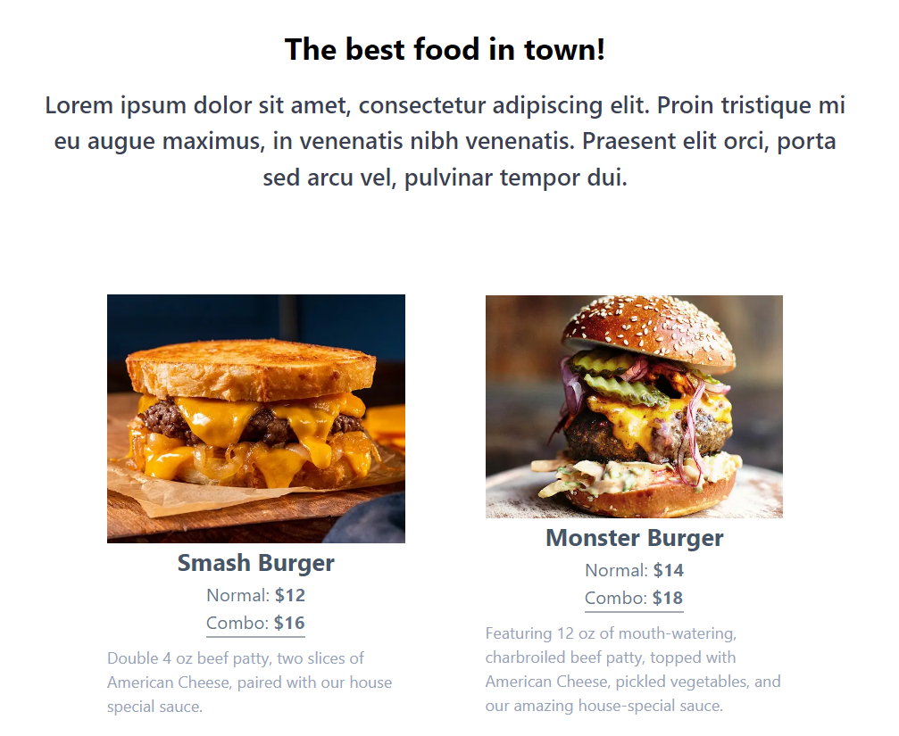
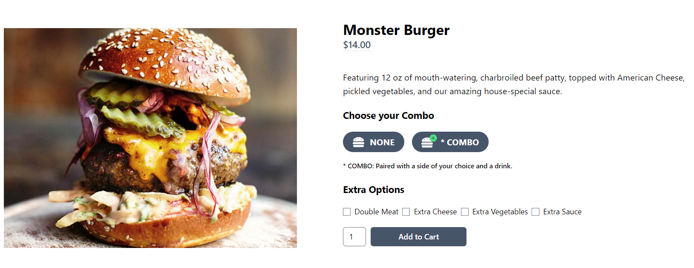
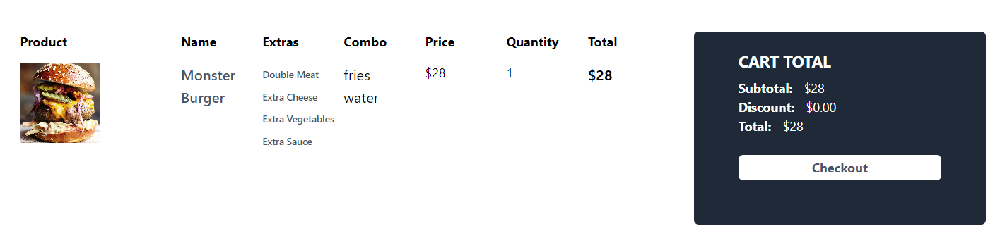
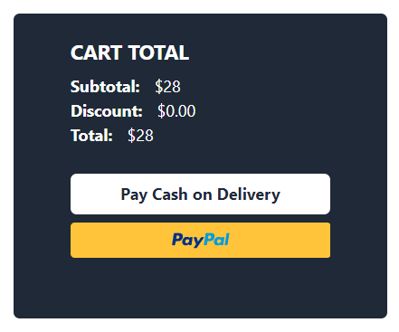
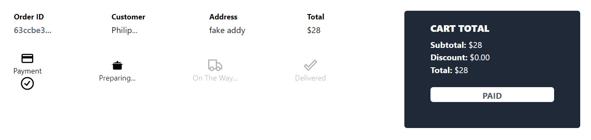
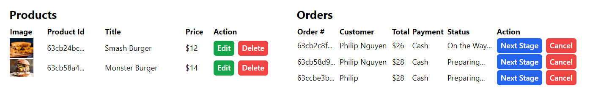
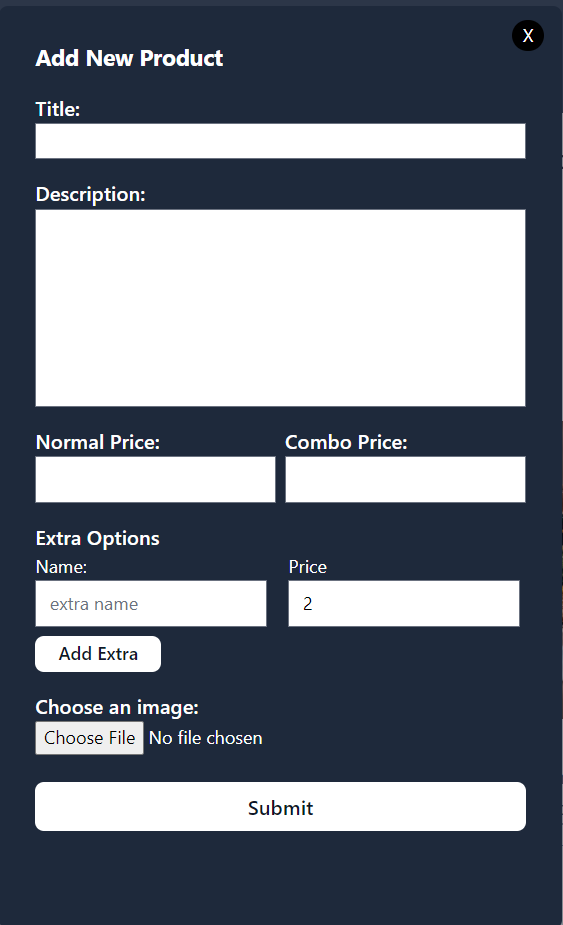
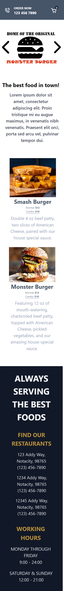

# restaurant-app

NextJS restaurant app that allows users to make online food orders through PayPal API.

## Technical Skills Used: 
 - React 
 - Redux Toolkit
 - NextJS
 - MongoDB
 - TailwindCSS

## Featuring...

### Featured / Image Slider

### Product List / Menu

### Footer

### Product Page
* Showcases the product
* Allows for customization (combo & extras)

### Cart Page
* Allows customer to confirm their order and checkout

### Payments
* Presents customer with payment options, including PayPal.

### Order Page
* Allows customer to check the current status of their order.

### Admin Page
* Allows for admin/worker computer to keep track of products and orders.
* Admin is able to delete and progress the status of orders.

### Add Product Functionality
* Allows Admin to add new products/menu items

### Responsive Design

